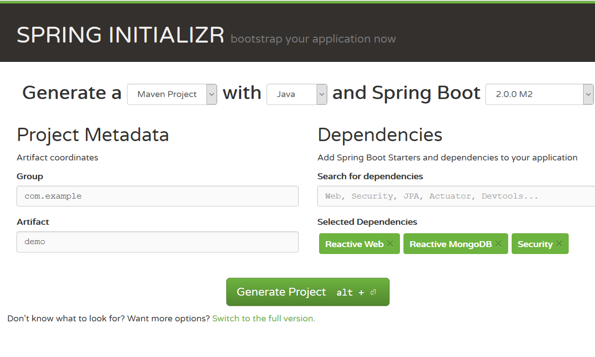

# Create a WebFlux application with Spring Boot

The Spring Boot 2.x targets the latest Spring technology stack, including Spring 5, Spring Security 5, Spring Session 2, etc. 

Spring Boot added a new starter `spring-boot-starter-webflux` for starting a WebFlux application.


## Generate project skeleton

Follow the following steps to prepare the project skeleton using [Spring initializr](http://start.spring.io).

Open your browser and navigate to [http://start.spring.io](http://start.spring.io). 



In the Spring Boot Initializr page, fill the following fields. 

1. Select the latest stable Spring Boot version, eg. 2.4.3 at the moment. 
2. In the dependencies box, type **reactive**, it will display all reactive options in a dropdown menu. Select **Ractive Web** to add `spring-boot-starter-webflux` into project dependencies. You can also add other items as you like, such as **Lombok**, **Reactive MongoDb**, **Reactive Redis** etc.
3. Click **Generate project** button or use **ALT+NETER** shortcut to generate a project skeleton as a zip file for downloading.

Download the archive and extract files into your disc, import the source codes into your IDEs.

Open the pom.xml, you will see the `spring-boot-starter-webflux` is added into *dependencies*.

```xml
<dependency>
	<groupId>org.springframework.boot</groupId>
	<artifactId>spring-boot-starter-webflux</artifactId>
</dependency>
```

And a `spring-boot-maven-plugin` is added in the initial pom.xml.

Spring Boot starter `spring-boot-starter-webflux` will handle the `spring-webflux` related dependencies and enable WebFlux support automatically. It also add `logback` as default logging handler.

Compare to the former vanilla version,

1. No need explicit `WebConfig`, Spring Boot configures it automatically.
2. The former bootstraping class or `AppInitializer` is no use now, the Spring Boot built-in `@SpringBootApplication` annotated class hands over the applicationContext lifecyle and application bootstrap.

```java
@SpringBootApplication
public class DemoApplication {

    public static void main(String[] args) {
        SpringApplication.run(DemoApplication.class, args);
    }
}
```

By default, Spring Boot will use Reactor Netty as runtime to run a WebFlux application. No need extra configuration for it.

To start the application in your terminal, run the following command in the project root folder.

```
mvn spring-boot:run
```

Alternatively, to start Spring Boot applications in your IDEs, run it just like running a general-purpose Java application.


## Getting Started

As an exercise, try to add the similar codes with [the former post](./first.md) to expose RESTful APIs for `Post`.

1. Add a POJO `Post`.
2. Add a dummy `PostRepository`.
3. Add a simple `PostController`.

Restart the application, and test the endpoints.

```bash
#curl http://localhost:8080/posts
...
```

Check the complete codes, [spring-reactive/boot](https://github.com/jwkidd3/spring-reactive/tree/master/boot-start).

## Bootstrap

By default, when `spring-boot-starter-webflux` is included in the classpath, it uses Netty as the embedded server to serve HTTP requests.

It is easy to switch to other embedded servers.

### Apache Tomcat

If you want to use Apache Tomcat as target runtime environment, just exclude `spring-boot-starter-reactor-netty` from `spring-boot-starter-webflux`, and add an extra dependency `spring-boot-starter-tomcat` into *pom.xml*.

```xml
<dependency>
	<groupId>org.springframework.boot</groupId>
	<artifactId>spring-boot-starter-webflux</artifactId>
	 <exclusions>
		<exclusion>
			<artifactId>spring-boot-starter-reactor-netty</artifactId>
			<groupId>org.springframework.boot</groupId>
		</exclusion>
	</exclusions>
</dependency>

<dependency>
	<groupId>org.springframework.boot</groupId>
	<artifactId>spring-boot-starter-tomcat</artifactId>
</dependency>
```

Check the sample codes, [spring-reactive/boot-tomcat](https://github.com/jwkidd3/spring-reactive/tree/master/boot-tomcat).

### Eclipse Jetty 

To use Jetty to replace the default Reactor Netty.

```xml
<dependency>
	<groupId>org.springframework.security</groupId>
	<artifactId>spring-security-webflux</artifactId>
	 <exclusions>
		<exclusion>
			<artifactId>spring-boot-starter-reactor-netty</artifactId>
			<groupId>org.springframework.boot</groupId>
		</exclusion>
	</exclusions>
</dependency>

<dependency>
	<groupId>org.springframework.boot</groupId>
	<artifactId>spring-boot-starter-jetty</artifactId>
</dependency>
```

Check the sample codes, [spring-reactive/boot-jetty](https://github.com/jwkidd3/spring-reactive/tree/master/boot-jetty).

### Undertow

Similiarly, you can use Undertow as target runtime.

```xml
<dependency>
	<groupId>org.springframework.boot</groupId>
	<artifactId>spring-boot-starter-webflux</artifactId>
	<exclusions>
		<exclusion>
			<artifactId>spring-boot-starter-reactor-netty</artifactId>
			<groupId>org.springframework.boot</groupId>
		</exclusion>
	</exclusions>
</dependency>

<dependency>
	<groupId>org.springframework.boot</groupId>
	<artifactId>spring-boot-starter-undertow</artifactId>
</dependency>
```

Check the sample codes, [spring-reactive/boot-undertow](https://github.com/jwkidd3/spring-reactive/tree/master/boot-undertow).